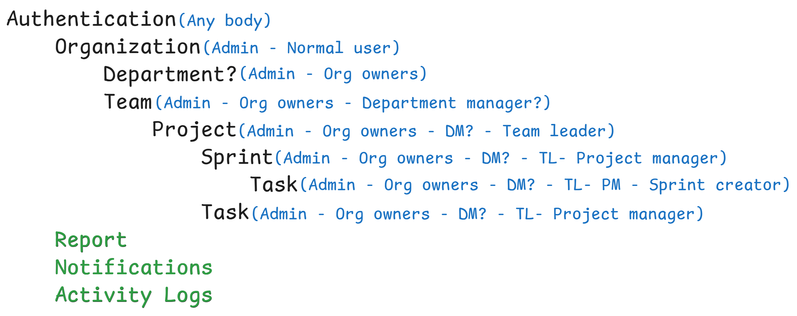

# Server Repository

This repository contains the server-side implementation for the project. It handles **backend logic**, **database** interactions, and serves **APIs** for the application.

## Usage

```bash

cd server/
#install first
npm install
# run the server
npm run start:dev # and makesure there is no error
```

## Project Structure Flow



## Completed Endpoints

You can test your APIs using **_Swagger_** from [_here_](http://localhost:3000/api-docs/) after running the server

base url: `http://localhost:3000`

### Auth

- Sign up or register: `POST /api/auth/signup`
- Resend OTP: `POST /api/auth/resendOTP`
- Verify email: `POST /api/auth/verifyEmail`
- Sign in or login: `POST /api/auth/signin`
- Forget Password: `POST /api/auth/forgotPassword`
- Reset Password: `POST /api/auth/resetPassword`
- Forget password without email: `POST /api/auth/forgotPasswordWithoutEmail`
- Reset password without email: `POST /api/auth/resetPasswordWithoutEmail`
- Refresh Access Token: `POST /api/auth/refreshAccessToken`
- Login with google: `POST /api/auth/google`
- Logout: `POST /api/auth/logout`
- Login using firebase: `POST /api/auth/firebase`

### User

- Get all users: `GET /api/users/all`
- Get a specific user: `GET /api/users/:id`
- Update a user: `PUT /api/users/:id`
- Update user password: `PATCH /api/users/update-password/:id`
- Delete a user: `DELETE /api/users/delete/:id`
- Restore a user: `PATCH /api/users/restore/:id`
- Upload user profile picture: `POST /api/users/:id/profile-picture`
- Delete user profile picture: `DELETE /api/users/:id/profile-picture`

### Organization

- Create an Organization: `POST /api/organization`
- Resend OTP: `POST /api/organization/resendOTP/:orgId`
- Verify an Organization: `POST /api/organization/verifyOrg/:orgId`
- Get all Organizations: `GET /api/organization/all`
- Get a specific Organization: `GET /api/organization/:organizationId`
- Update an Organization: `PUT /api/organization/:organizationId`
- Delete an Organization: `DELETE /api/organization/:organizationId`
- Add owners to the org: `POST /api/organization/:organizationId/addOwner`
- Upload the organization logo: `POST /api/organization/:organizationId/logo/upload`
- Delete the organization logo: `DELETE /api/organization/:organizationId/logo/delete`

### Department

- Get all Departments: `GET /api/organizations/:organizationId/departments/all`
- Get department by id: `GET /api/organizations/:organizationId/departments/:departmentId`
- Create a Department: `POST /api/organizations/:organizationId/departments/create`
- Update a Department: `PUT /api/organizations/:organizationId/departments/:departmentId`
- Soft Delete a Department: `DELETE /api/organizations/:organizationId/departments/:departmentId/delete`
- Restore a Department: `PATCH /api/organizations/:organizationId/departments/:departmentId/restore`

### Team

- Create a new team in a specific organization: `POST /api/organization/:organizationId/team`
- Add new team members: `POST /api/organization/:organizationId/team/:teamId/addMember`
- Remove member from a team: `DELETE /api/organization/:organizationId/team/:teamId/members/:memberId`
- Update a team: `PUT /api/organization/:organizationId/team/:teamId`
- Upload team avatar: `POST /api/organization/:organizationId/team/:teamId/avatar/upload`
- Delete team avatar: `DELETE /api/organization/:organizationId/team/:teamId/avatar/delete`
- Delete a team: `DELETE /api/organization/:organizationId/team/:teamId`
- Get all teams: `GET /api/organization/:organizationId/teams/all`
- Get a specific team: `GET /api/organization/:organizationId/teams/:teamId`

### Project

- Create a new project: `POST /api/organization/:organizationId/team/:teamId/project`
- Update a project: `PUT /api/organization/:organizationId/team/:teamId/project/:projectId`
- Update the project status: `PATCH /api/organization/:organizationId/team/:teamId/project/:projectId/status`
- Update the project priority: `PATCH /api/organization/:organizationId/team/:teamId/project/:projectId/priority`
- Delete a project: `DELETE /api/organization/:organizationId/team/:teamId/project/:projectId/delete`
- Restore a project: `PATCH /api/organization/:organizationId/team/:teamId/project/:projectId/restore`
- Add new member in the project: `POST /api/organization/:organizationId/team/:teamId/project/:projectId/addMember`
- Remove member from a project: `DELETE /api/organization/:organizationId/team/:teamId/project/:projectId/removeMember`
- Get all projects: `GET /api/organization/:organizationId/team/:teamId/project/all`
- Get a specific project: `GET /api/organization/:organizationId/team/:teamId/project/:projectId`

### Task

- Create a new task: `POST /api/organization/:organizationId/team/:teamId/project/:projectId/task/create`
- Update a task: `PUT /api/organization/:organizationId/team/:teamId/project/:projectId/task/:taskId`
- Update the task priority: `PATCH /api/organization/:organizationId/team/:teamId/project/:projectId/task/:taskId/priority`
